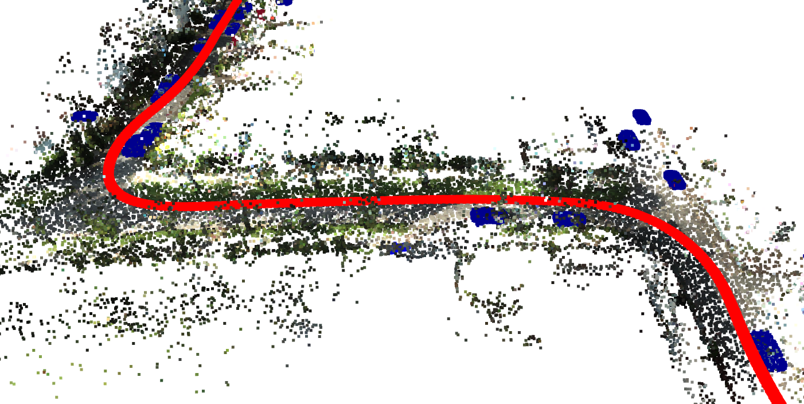
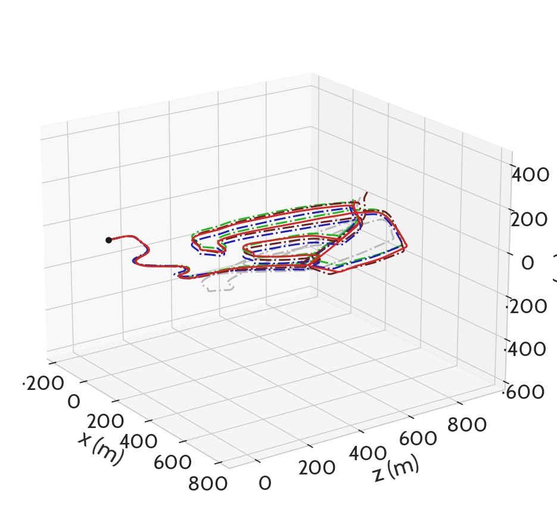

# PWCLO-NET_pyLiDAR-SLAM

> To access the actual Git repository containing the code, please refer to the following [**link**](https://github.com/saali14/PWCLONet_pyLiDARSLAM).

## Overview

This is a demonstration of my master thesis in [**SnT**](https://www.uni.lu/snt-en/) with the [**CVI2 group**](https://cvi2.uni.lu/) under the supervision of Dr. Sk Aziz Ali. It proposes a PyTorch implementation of [**PWCLO-Net**](https://github.com/IRMVLab/PWCLONet) integrated into the [**pyLiDAR-SLAM toolox**](https://github.com/Kitware/pyLiDAR-SLAM).

To gain a comprehensive understanding of the surrounding environment, a vehicle must possess the ability to generate highly accurate maps, enabling it to analyze potential risks and plan for future decisions effectively. However, creating maps from 3D point clouds is a complex undertaking, as it necessitates precise matching between point clouds from consecutive frames through point cloud registration methods. In this context, LiDAR-SLAM (Simultaneous Localization and Mapping) emerges as a vital and intriguing solution that facilitates the seamless matching of point clouds between two frames, subsequently calculating the pose transformation required to convert the first point cloud to the second. This process allows for the accumulation of point clouds, resulting in the creation of dense and detailed maps representing the surrounding environment.

LiDAR odometry is a crucial component of LiDAR-based Simultaneous Localization and Mapping (SLAM) systems. Its primary objective is to estimate the vehicle's motion or pose using LiDAR point cloud data captured from consecutive frames \cite{odometry_wikipedia}. Accurate odometry is essential for understanding the vehicle's movement through the environment, which in turn enables precise mapping and navigation.

Aligned with the ambitious goals of advancing LiDAR-SLAM research, the [**pyLiDAR-SLAM**](https://github.com/Kitware/pyLiDAR-SLAM) toolbox emerges as a comprehensive tool addressing the needs of **LiDAR odometry** and point cloud registration. This versatile toolkit provides modular and user-friendly Python and PyTorch implementations of various LiDAR odometry methods, positioning itself as a valuable resource for evaluation and comparison across diverse public datasets.

The pyLiDAR-SLAM toolbox offers a flexible and efficient solution for LiDAR-SLAM, empowering researchers and engineers to understand, experiment, and test LiDAR-SLAM on various datasets. Its modular design and integration of geometric methods and deep learning techniques provide a powerful platform for customizing and extending the pipeline. By uniting the strengths of computer vision and LiDAR-based perception, pyLiDAR-SLAM paves the way for advancing autonomous navigation, mapping, and perception systems.

Although pyLiDAR-SLAM offers various features, it lacks implementations of well-known deep learning methods such as PWCLO-Net or SUMA++. In this study, a user-friendly [**PWCLO-Net**](https://github.com/IRMVLab/PWCLONet) adaptation that adheres to the pyLiDAR-SLAM framework will be presented.

The figure below displays the predicted paths of four models trained and tested on the [**KITTI dataset**](https://www.cvlibs.net/datasets/kitti/), along with the ground truth path shown in red:
* The pre-trained model proposed in the original PWCLO-Net repository (code in TensorFlow): path in green.
* Three additional models we propose (code in PyTorch): paths in gray, blue and brown.

For more details, please refer to this [**repository**](https://github.com/saali14/PWCLONet_pyLiDARSLAM) and my [**Master's Thesis report**](./SDIA_ELAMINE_Mohammed_Rapport_3A.pdf).

